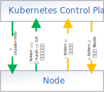

## 每天积累点 Kubernetes 小知识

> 不积跬步无以至千里， 不积小流无以成江海

### 问题描述

使用 `kubeadm` 部署过 Kubernetes 集群的朋友一定知道，在执行完 `kubeadm init` 初始化控制平面节点后，会有一句类似如下这样的输出语句，提示如何加入工作节点：

```sh
kubeadm join x.x.x.x:6443 --token xxxx.xxxxxxx --discovery-token-ca-cert-hash sha256:xxxxxxx
```

那么问题来了，`token` 与 `discovery-token-ca-cert-hash` 分别是做什么用的呢？

- A. 均用于获取控制平面的信任
- B. 均用于验证控制平面是否可信
- C. `token` 用于获取控制平面的信任，`discovery-token-ca-cert-hash` 用于验证控制平面是否可信
- D. `token` 既用于获取控制平面的信任，也用于验证控制平面是否可信
- E. `discovery-token-ca-cert-hash` 用于验证控制平面是否可信

### 问题解析

在将新节点加入集群时，需要建立双向信任，如下图所示：



准确来说， `kubeadm` 支持两种 `Token`：

* 一种是 `discovery-token`：`kubeadm` 使用它对从控制平面读取到的集群信息（即 `kube-public/cluster-info` ConfigMap）进行验签以验证其有效性，同时该 `token` 也代表着一个用户，是 APIServer 对请求进行权限验证的依据；
* 一种是 `tls-bootstrap-token`：`kubelet` 首次启动时使用它建立与控制平面的临时可信连接，然后发起 CSR 证书签名请求，以换取签名后的证书，之后使用证书实现最终的安全通信；

回到本题，上述 `join` 命令中的 `token` 参数其实同时代表了这两类 `Token`（如果你没有使用 `discovery-token`、`tls-bootstrap-token` 参数明确指明要使用的 `Token` 的话，那么这两个参数的值默认都等于 `token` 参数配置的值）。

那这两种 `Token` 分别在什么时候会被用到呢？

在连接建立之初，`Node` 节点没有任何可用的证书凭证，它只能使用用户提供的 `token` （即 `discovery-token`）构造一个不安全的连接，尝试读取集群中的 `kube-public/cluster-info` ConfigMap。待读取成功后，它会使用 `token` 对 ConfigMap 内保存的集群信息（即 `kubeconfig`）进行 JWS 签名，并与该 ConfigMap 内保存的签名信息作比较，只有实际计算出的签名值与保存的签名值一致，`kubeadm` 才会信任控制面。如果用户同时指定了 `discovery-token-ca-cert-hash` 参数，`kubeadm` 还会计算该 ConfigMap 内保存的 CA 的哈希码，然后对比是否与用户提供的一致，只有一致 `kubeadm` 才会信任控制面。如果这些验证一切顺利，那么 `Node` 就建立了对控制面的信任。该过程，我们也可以称作 `Discovery`，简单可以理解为发现集群、确认集群可信的意思。

我们可以大致看下 `kube-public/cluster-info` ConfigMap 保存的内容：

```
Name:         cluster-info
Namespace:    kube-public
Labels:       <none>
Annotations:  <none>

Data
====
jws-kubeconfig-u0kckt:
----
eyJhbGciOXXXXK0U
kubeconfig:
----
apiVersion: v1
clusters:
- cluster:
    certificate-authority-data: LS0XXXXQo=
    server: https://192.168.137.71:6443
  name: ""
contexts: []
current-context: ""
kind: Config
preferences: {}
users: []

Events:  <none>
```

其实主要就是保存了集群所使用的 CA 的公钥信息以及连接地址，其中 `jws-kubeconfig-u0kckt` 即为验签时所要比对的签名信息。

那控制面如何信任新加入的节点呢？其实也是基于 `token`。我们知道，`cluster-info` 的读取是不需要权限的，匿名即可读取。但对于其它资源，如 `kube-system/kubeadm-config` ConfigMap，则只允许具有访问权限的用户访问。此时，`token`（`discovery-token`） 就又派上用场了。`kubeadm` 会使用 `cluster-info` 构造集群信息，使用 `token` 构造用户信息，创造一个完整的 KubeConfig 对象，而基于这个 KubeConfig 创建的 Client 就具备了 `token` 所代表用户的执行权限（即该用户被控制平面信任）。此外，`kubelet` 在启动时会先以 `token`（`tls-bootstrap-token`） 用户身份连接 APIServer，然后发送 CSR 证书签名申请，获取被 CA 签名后的证书，之后就直接使用签名后的证书实现安全通信（因为 `token` 存在有效期，`kubelet` 使用它与 APIServer 通信只是临时的，最后还是要靠证书通信），这个过程即为 `TLSBootstrap`。

特别说明，该 `token` 用户的创建和授权是在 `kubeadm init` 阶段完成的。

**正确答案：DE**
